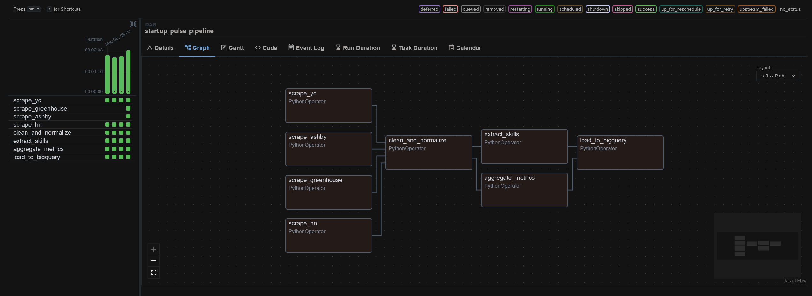
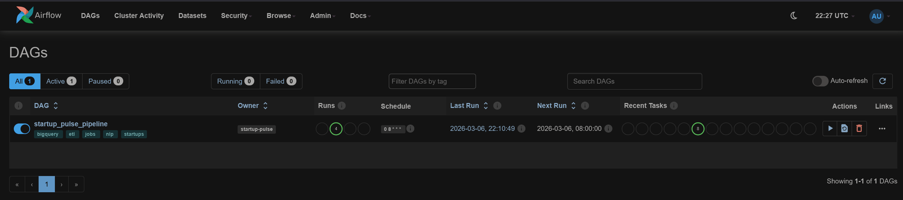
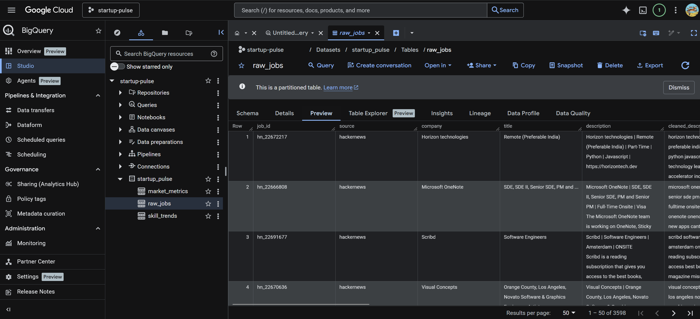
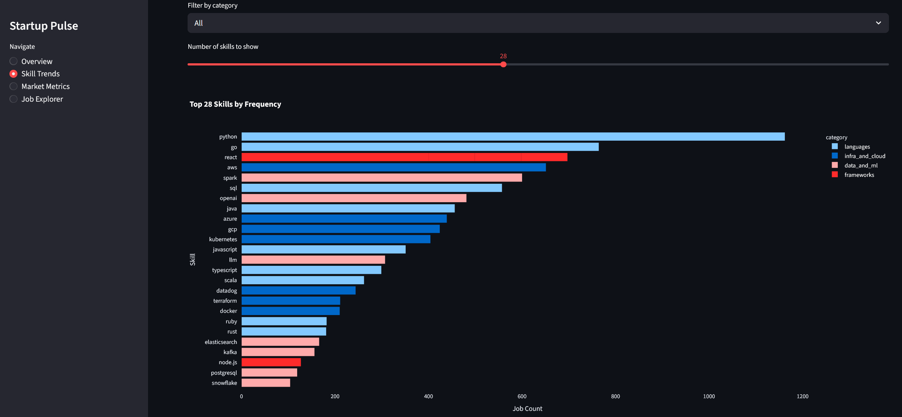
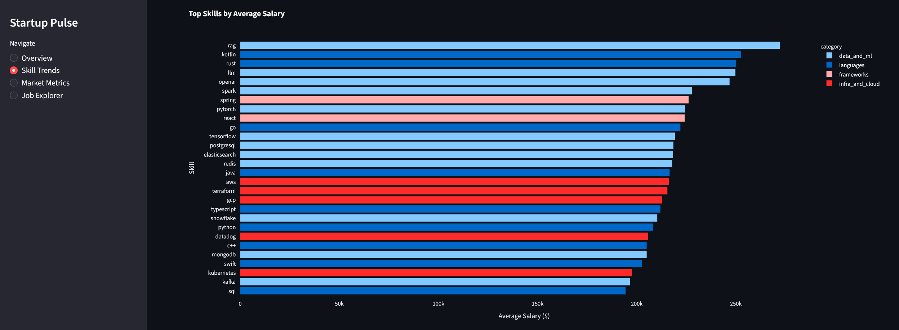
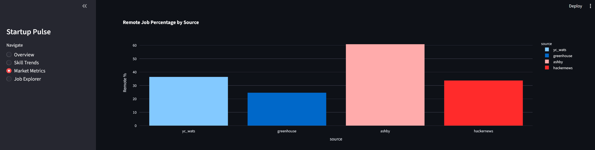

# Startup Pulse — Job Market Intelligence Platform

An automated data pipeline that scrapes software engineering job postings from YC, Greenhouse, Ashby, Lever, and Hacker News, extracts trending skills using NLP, and visualizes market signals through an interactive dashboard.

Built with GitHub Actions, Google BigQuery, and Streamlit. Also supports local development with Apache Airflow and Docker Compose.

## Platform Preview

Below are some snapshots of the pipeline and analytics dashboard in action.

---

## Pipeline Orchestration

The ETL pipeline runs daily via **GitHub Actions** (cloud) or **Apache Airflow** (local development), scraping all 5 job sources and loading results into BigQuery.

| Airflow DAG View | Task Execution Dashboard |
|----------|-------------------------|
|  |  |

In production, GitHub Actions runs the pipeline on a daily cron schedule with manual trigger support. For local development, Apache Airflow provides a UI for monitoring and debugging.

---

## BigQuery Data Warehouse

All collected jobs are stored in **Google BigQuery**, where the pipeline maintains structured tables for raw jobs, skill trends, and market metrics.



This allows the dashboard to query thousands of job postings instantly and compute metrics like salary distributions, remote job percentages, and skill demand.

---

## Streamlit Analytics Dashboard

The **Streamlit dashboard** provides interactive insights into the software engineering job market.

### Most In-Demand Skills



Shows which technologies appear most frequently across scraped job postings.

---

### Skills vs Salary



Highlights skills associated with the highest average salary ranges across postings.

---

### Remote Job Distribution



Displays how frequently remote work appears across the different job sources.

---

> End-to-end pipeline: **Scrape → Process → Analyze → Visualize**

## Architecture

```
Job Board Scrapers
  (Playwright + APIs)
       |
       v
+------------------+
| GitHub Actions / |     Daily at 08:00 UTC
| Apache Airflow   |
+--------+---------+
         |
         v
+--------+---------+     +-------------------+     +-----------------+
|    EXTRACT       | --> |    TRANSFORM      | --> |      LOAD       |
| Scrape YC,       |     | Clean text (NLTK) |     | Deduplicate     |
| Greenhouse,      |     | Extract skills    |     | Validate        |
| Ashby, Lever, HN |     |   (TF-IDF +       |     | Append to       |
| in parallel      |     |    taxonomy)       |     |   BigQuery      |
|                  |     | Market metrics    |     |                 |
+------------------+     +-------------------+     +-----------------+
                                                          |
                                                          v
                                                   +-----------+
                                                   |  BigQuery  |
                                                   | 3 tables:  |
                                                   | raw_jobs   |
                                                   | skill_     |
                                                   |   trends   |
                                                   | market_    |
                                                   |   metrics  |
                                                   +-----+-----+
                                                         |
                                                         v
                                                   +-----------+
                                                   | Streamlit  |
                                                   | Dashboard  |
                                                   +-----------+
```

## Data Sources

All sources are filtered to **software engineering roles only** using regex-based title and department matching.

| Source | Method | Data |
|--------|--------|------|
| [Work at a Startup](https://www.workatastartup.com/jobs) (YC) | Playwright (JS-rendered) | ~55 software roles from 2 engineering categories, YC batch, description |
| [Greenhouse](https://www.greenhouse.io/) (22 companies) | Public JSON API | ~2,300 software roles from Stripe, Airbnb, Figma, Databricks, etc. |
| [Ashby](https://www.ashbyhq.com/) (18 companies) | Public Posting API | ~800 software roles from OpenAI, Notion, Cursor, Linear, Ramp, etc. |
| [Lever](https://www.lever.co/) (11 companies) | Public Postings API | ~750 software roles from Spotify, Palantir, Plaid, Zoox, Mistral, etc. |
| [HN "Who is Hiring?"](https://news.ycombinator.com/) | HN Firebase API | Monthly thread, 400+ postings per thread |

The pipeline scrapes all five sources daily, yielding ~4,200 unique software job postings per run after deduplication.

## Tech Stack

| Component | Technology | Purpose |
|-----------|-----------|---------|
| CI/CD & Scheduling | GitHub Actions | Daily cron pipeline + manual triggers |
| Orchestration (Local) | Apache Airflow 2.11.0 | Local development DAG with task UI |
| Data Warehouse | Google BigQuery | Store and query structured data |
| Visualization | Streamlit (Community Cloud) | Interactive analytics dashboard |
| Scraping | Playwright + Greenhouse/Ashby/Lever APIs | Headless browser for JS pages, REST APIs for Greenhouse, Ashby, and Lever |
| NLP | NLTK + scikit-learn TF-IDF | Text cleaning and skill extraction |
| Infrastructure (Local) | Docker Compose + PostgreSQL 15 | Local container orchestration |

## ETL Pipeline

The pipeline runs daily at 08:00 UTC via GitHub Actions (or locally via Airflow) and executes 9 tasks:

```
scrape_yc ----------\
scrape_greenhouse ---\
scrape_ashby ---------+--> clean_and_normalize --+--> extract_skills ---+--> load_to_bigquery
scrape_lever --------/                           +--> aggregate_metrics-+
scrape_hn ----------/
```

### Extract
- Five scrapers run in parallel — one per source
- YC uses Playwright (headless Chromium) across 2 software engineering categories
- Greenhouse uses the free, unauthenticated Job Board API across 22 company boards
- Ashby uses the free, unauthenticated Posting API across 18 company boards
- Lever uses the free, unauthenticated Postings API across 11 company boards
- HN uses the Firebase API (no browser needed)
- Non-software roles are filtered out using regex-based title/department matching
- Each scraper normalizes data into a shared schema before writing to disk

### Transform
Two parallel processing steps after text cleaning:

1. **Skill Extraction** (TF-IDF + Taxonomy): Matches job descriptions against a curated taxonomy of 60+ tech skills across 4 categories (languages, frameworks, infra/cloud, data/ML). Enriches each skill with salary correlation data.
2. **Market Metrics** (numpy): Computes per-source statistics — average salary, median salary, remote percentage, top role categories.

### Load
- Deduplicates within each run and across runs (queries existing job_ids from last 7 days)
- Validates data (null checks, text truncation, type enforcement)
- Appends to BigQuery tables with retry logic on transient errors

## BigQuery Schema

Three tables, all partitioned by `collected_at` (DAY):

**`raw_jobs`** — Every collected job posting with original and cleaned description
- Clustered by `source, company_stage`
- Key columns: `job_id`, `company`, `title`, `salary_min`, `salary_max`, `remote`, `yc_batch`

**`skill_trends`** — Skill frequency and salary data per collection window
- Clustered by `category`
- Key columns: `skill`, `tfidf_score`, `frequency`, `avg_salary`, `num_jobs`

**`market_metrics`** — Aggregated market stats per source
- Clustered by `source, role_category`
- Key columns: `avg_salary`, `median_salary`, `remote_pct`, `total_jobs`

## Dashboard

The Streamlit dashboard (port 8501) has four views:

**Overview** — KPI cards (total jobs, active sources, unique skills, average remote %) with top skills table, sources overview, and latest job postings

**Skill Trends** — Bar charts of in-demand skills by frequency and by average salary, category filter (languages/frameworks/infra/data), detailed skill table with TF-IDF scores

**Market Metrics** — Jobs by source, remote percentage by source, salary distribution box plots, jobs by company stage pie chart

**Job Explorer** — Searchable, filterable table of recent job postings with source, remote status, and text search filters

## Project Structure

```
startup-pulse/
├── .github/workflows/
│   └── pipeline.yml            # GitHub Actions: daily ETL cron + manual trigger
├── docker-compose.yml          # 5 services: postgres, airflow-init, webserver, scheduler, streamlit
├── Makefile                    # make up/down/restart/logs/build/init-bq
├── .env.example                # Template for environment variables
│
├── airflow/
│   ├── Dockerfile              # apache/airflow:2.11.0 + Playwright + Python deps
│   ├── requirements.txt        # playwright, beautifulsoup4, google-cloud-bigquery, nltk, scikit-learn
│   └── dags/
│       └── startup_pulse_dag.py
│
├── src/
│   ├── extract/
│   │   ├── yc_scraper.py          # YC Work at a Startup scraper (Playwright)
│   │   ├── greenhouse_scraper.py  # Greenhouse Job Board API scraper (REST)
│   │   ├── ashby_scraper.py       # Ashby Posting API scraper (REST)
│   │   ├── lever_scraper.py       # Lever Postings API scraper (REST)
│   │   └── hn_scraper.py          # HN Who is Hiring? scraper (API)
│   ├── transform/
│   │   ├── text_cleaner.py        # NLTK text preprocessing pipeline
│   │   ├── skill_extractor.py     # TF-IDF + taxonomy skill extraction
│   │   └── metrics_aggregator.py  # Market statistics
│   ├── load/
│   │   └── bigquery_loader.py     # BigQuery insertion with deduplication
│   └── utils/
│       ├── config.py              # Centralized configuration + skill taxonomy + role filter
│       └── deduplication.py       # In-run and cross-run dedup logic
│
├── streamlit_app/
│   ├── Dockerfile              # python:3.11-slim + streamlit + plotly
│   ├── requirements.txt
│   ├── app.py                  # Dashboard with 4 views
│   └── utils/
│       └── bq_client.py        # Cached BigQuery client
│
├── scripts/
│   ├── init_bigquery.py        # One-time dataset and table creation
│   └── run_pipeline.py         # Standalone ETL runner (GitHub Actions / local)
│
├── tests/
│   ├── test_hn_scraper.py
│   ├── test_yc_scraper.py
│   ├── test_greenhouse_scraper.py
│   ├── test_ashby_scraper.py
│   ├── test_lever_scraper.py
│   ├── test_text_cleaner.py
│   ├── test_skill_extractor.py
│   └── test_metrics_aggregator.py
│
└── credentials/                # GCP service account key (gitignored)
```

## Quick Start

### Cloud (Recommended)

1. Set up a GCP project with BigQuery enabled and a service account key ([details](SETUP_GUIDE.md#2-google-cloud-platform-setup))
2. Add GitHub secrets: `GCP_SA_KEY`, `GCP_PROJECT_ID`, `BQ_DATASET` ([details](SETUP_GUIDE.md#step-121-add-github-secrets))
3. Go to **Actions > ETL Pipeline > Run workflow** to trigger the pipeline
4. Deploy the dashboard on [Streamlit Community Cloud](https://share.streamlit.io/) ([details](SETUP_GUIDE.md#step-123-deploy-streamlit-dashboard))

### Local Development

```bash
cp .env.example .env                    # Configure GCP credentials
cp /path/to/key.json credentials/service-account.json
make build && make up                   # Start Docker Compose (Airflow + Streamlit)
make init-bq                            # Create BigQuery tables
# Airflow UI: http://localhost:8080     Streamlit: http://localhost:8501
```

See [SETUP_GUIDE.md](SETUP_GUIDE.md) for detailed step-by-step instructions.

## Deployment Options

| Mode | ETL Runner | Dashboard | Best For |
|------|-----------|-----------|----------|
| **Local** | Docker Compose + Airflow | `localhost:8501` | Development and debugging |
| **Cloud (Free)** | GitHub Actions (daily cron) | Streamlit Community Cloud | Zero-maintenance, shareable URL |

Both modes use the same BigQuery data warehouse and Python code. See [SETUP_GUIDE.md](SETUP_GUIDE.md) Sections 12-13 for cloud setup and switching instructions.

## Free-Tier Budget

| Resource | Free Tier Limit | Estimated Usage | Headroom |
|----------|----------------|-----------------|----------|
| GitHub Actions | 2,000 min/month | ~150 min/month | 92% free |
| Streamlit Cloud | Unlimited (public apps) | 1 app | -- |
| BigQuery Storage | 10 GB/month | ~50 MB/month | 99.5% free |
| BigQuery Queries | 1 TB/month | ~2 GB/month | 99.8% free |

## Configuration

All pipeline settings are centralized in `src/utils/config.py`:

```python
# Data source URLs
YC_JOBS_BASE_URL = "https://www.workatastartup.com/jobs/l"
GREENHOUSE_API_BASE = "https://boards-api.greenhouse.io/v1/boards"
ASHBY_API_BASE = "https://api.ashbyhq.com/posting-api/job-board"
LEVER_API_BASE = "https://api.lever.co/v0/postings"
HN_API_BASE = "https://hacker-news.firebaseio.com/v0"

# 22 company boards scraped via Greenhouse public API
GREENHOUSE_BOARD_TOKENS = ["stripe", "airbnb", "figma", "databricks", ...]

# 18 company boards scraped via Ashby public API
ASHBY_BOARD_TOKENS = ["openai", "notion", "cursor", "linear", "ramp", ...]

# 11 company boards scraped via Lever public API
LEVER_BOARD_TOKENS = ["spotify", "palantir", "plaid", "zoox", "mistral", ...]

# Software role filter — only engineering/CS roles are kept
def is_software_role(title, department=""):
    """Return True if the job title or department indicates a software role."""

# Skill taxonomy (60+ skills across 4 categories)
SKILL_TAXONOMY = {
    "languages": ["python", "javascript", "typescript", "go", "rust", ...],
    "frameworks": ["react", "next.js", "django", "fastapi", ...],
    "infra_and_cloud": ["aws", "docker", "kubernetes", "terraform", ...],
    "data_and_ml": ["pytorch", "spark", "airflow", "bigquery", "llm", ...],
}
```

## How It Works

### Skill Extraction

The system identifies trending tech skills using two complementary approaches:

1. **Taxonomy Matching**: A curated list of 60+ skills is matched against cleaned job descriptions using word-boundary regex. This catches known skills reliably.
2. **TF-IDF Scoring**: A `TfidfVectorizer` fits across all descriptions to surface emerging terms that aren't in the taxonomy yet. Skills are ranked by frequency and enriched with average salary data for jobs mentioning that skill.

### Salary Extraction

Job postings express salaries in many formats ($150K, $150,000, $150k-$200k). The scrapers use regex patterns to normalize these into `salary_min` and `salary_max` integers, enabling salary analysis by skill, role, and source.

### Deduplication

Jobs are deduplicated at two levels:
- **Within each run**: Same job appearing in multiple scrape pages is kept once via content hashing
- **Across runs**: Before loading to BigQuery, existing `job_id` values from the last 7 days are queried and filtered out

### Error Resilience

- Individual scraper failures don't block the pipeline — if one source is down, others still flow
- BigQuery load retries on `ServiceUnavailable` errors with exponential backoff
- Missing BigQuery tables are auto-created on first load attempt
- GitHub Actions provides run logs and failure notifications
